# DDD Microservices Architecture

A comprehensive microservices architecture built with Domain-Driven Design principles, featuring user management, product catalog, shopping basket, and payment processing services.

## Architecture Overview

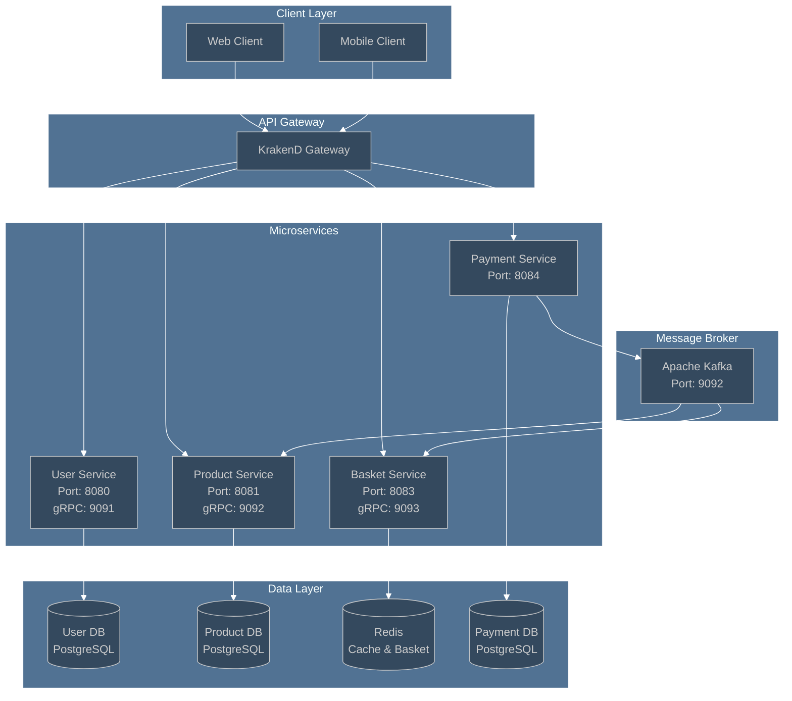

## Service Communication Flow

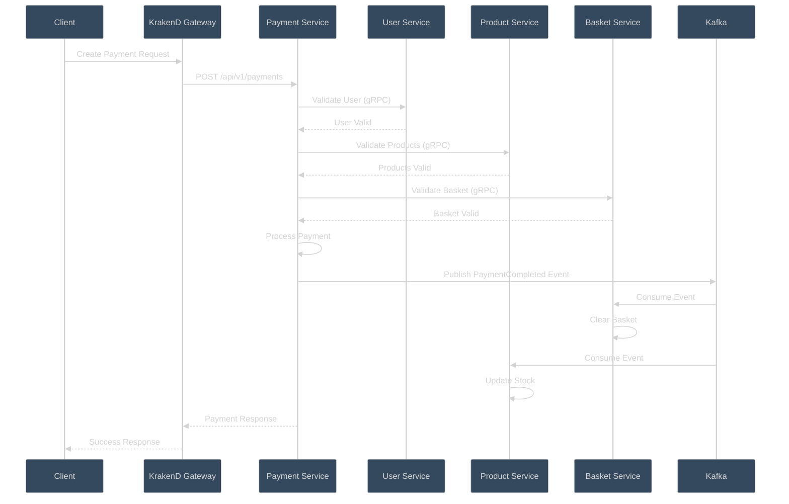

## Domain Layer Architecture

```mermaid
%%{init: {'theme':'dark', 'themeVariables': { 'primaryColor': '#ff6b6b', 'primaryTextColor': '#ffffff', 'primaryBorderColor': '#ff6b6b', 'lineColor': '#ffffff', 'secondaryColor': '#4ecdc4', 'tertiaryColor': '#45b7d1', 'background': '#2c3e50', 'mainBkg': '#34495e', 'secondBkg': '#2c3e50', 'tertiaryBkg': '#34495e'}}}%%
graph TB
    subgraph "User Service Domain"
        U_ENTITY[User Entity]
        U_REPO[User Repository]
        U_SERVICE[User Service]
        U_ERR[Domain Errors]
    end
    
    subgraph "Product Service Domain"
        P_ENTITY[Product Entity]
        P_REPO[Product Repository]
        P_SERVICE[Product Service]
        P_ERR[Domain Errors]
    end
    
    subgraph "Basket Service Domain"
        B_ENTITY[Basket Entity]
        B_REPO[Basket Repository]
        B_SERVICE[Basket Service]
        B_ERR[Domain Errors]
    end
    
    subgraph "Payment Service Domain"
        PAY_ENTITY[Payment Entity]
        PAY_REPO[Payment Repository]
        PAY_GATEWAY[Payment Gateway]
        PAY_SERVICE[Payment Service]
        PAY_ERR[Domain Errors]
    end
    
    U_ENTITY --> U_REPO
    U_REPO --> U_SERVICE
    U_SERVICE --> U_ERR
    
    P_ENTITY --> P_REPO
    P_REPO --> P_SERVICE
    P_SERVICE --> P_ERR
    
    B_ENTITY --> B_REPO
    B_REPO --> B_SERVICE
    B_SERVICE --> B_ERR
    
    PAY_ENTITY --> PAY_REPO
    PAY_REPO --> PAY_SERVICE
    PAY_GATEWAY --> PAY_SERVICE
    PAY_SERVICE --> PAY_ERR
```

## CQRS Pattern Implementation

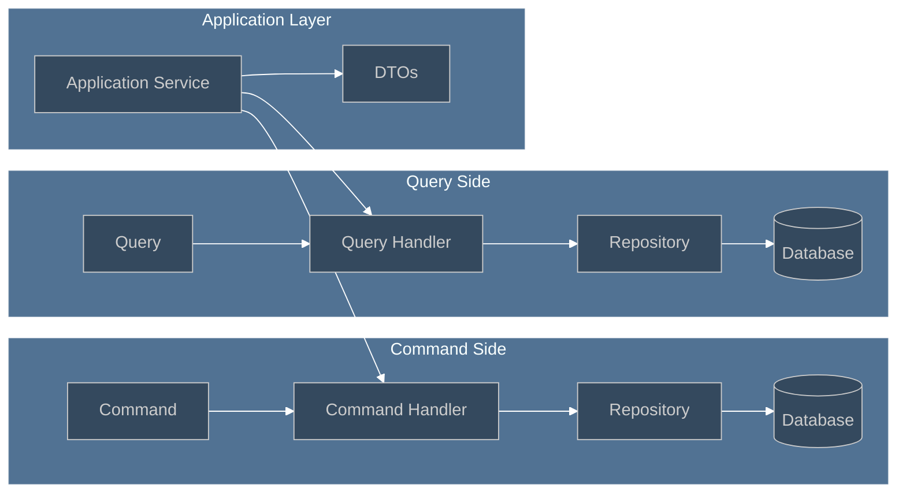

## Event-Driven Architecture

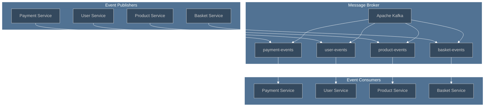

## Payment Flow Architecture

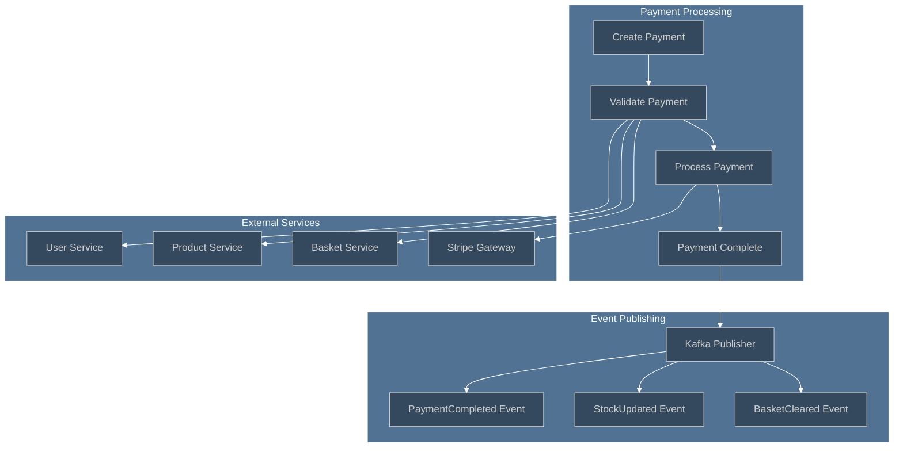

## Technology Stack

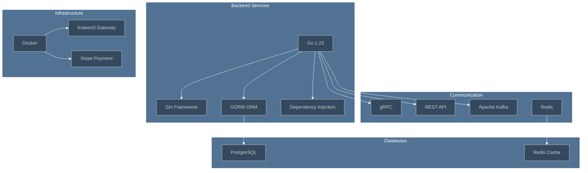

## Dependency Management

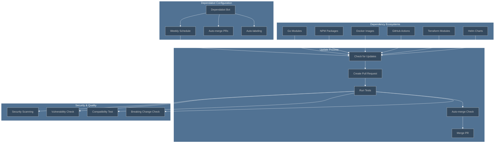

## Service Dependencies

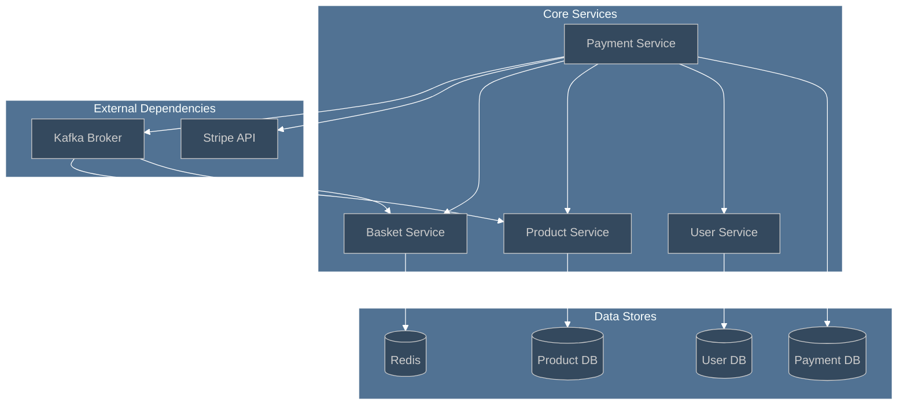

## API Gateway Routing

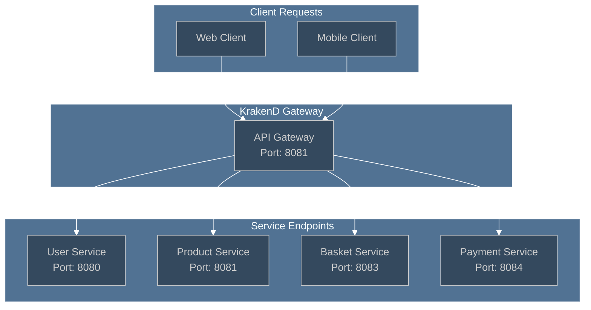

## Database Schema Overview

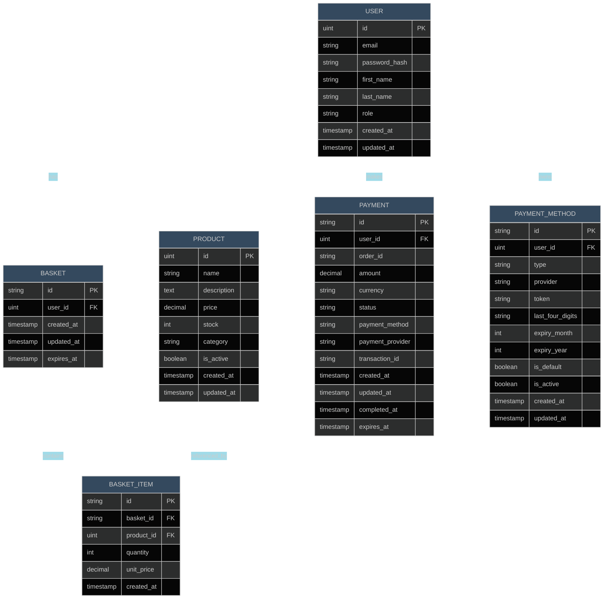

## Terraform Infrastructure Architecture

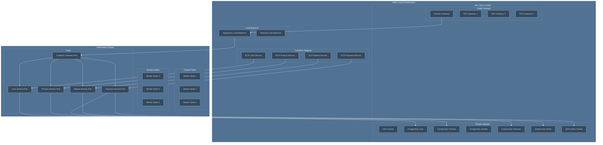

## Ansible Configuration Management

```mermaid
%%{init: {'theme':'dark', 'themeVariables': { 'primaryColor': '#ff6b6b', 'primaryTextColor': '#ffffff', 'primaryBorderColor': '#ff6b6b', 'lineColor': '#ffffff', 'secondaryColor': '#4ecdc4', 'tertiaryColor': '#45b7d1', 'background': '#2c3e50', 'mainBkg': '#34495e', 'secondBkg': '#2c3e50', 'tertiaryBkg': '#34495e'}}}%%
graph TB
    subgraph "Ansible Control Node"
        ANSIBLE[Ansible Controller]
        INVENTORY[Inventory Files]
        PLAYBOOKS[Playbooks]
        ROLES[Roles]
    end
    
    subgraph "Target Infrastructure"
        subgraph "Kubernetes Masters"
            K8S_MASTER1[Master Node 1]
            K8S_MASTER2[Master Node 2]
            K8S_MASTER3[Master Node 3]
        end
        
        subgraph "Kubernetes Workers"
            K8S_WORKER1[Worker Node 1]
            K8S_WORKER2[Worker Node 2]
            K8S_WORKER3[Worker Node 3]
        end
        
        subgraph "Database Servers"
            POSTGRES_DB[PostgreSQL Server]
            REDIS_DB[Redis Server]
            KAFKA_DB[Kafka Brokers]
        end
        
        subgraph "Monitoring Servers"
            PROMETHEUS_SRV[Prometheus Server]
            GRAFANA_SRV[Grafana Server]
            JAEGER_SRV[Jaeger Server]
        end
        
        subgraph "Load Balancers"
            NGINX_LB1[Nginx LB 1]
            NGINX_LB2[Nginx LB 2]
        end
    end
    
    subgraph "Ansible Roles"
        K8S_ROLE[k8s-setup Role]
        HELM_ROLE[helm-deploy Role]
        MONITORING_ROLE[monitoring Role]
        SECURITY_ROLE[security Role]
        BACKUP_ROLE[backup Role]
    end
    
    ANSIBLE --> INVENTORY
    ANSIBLE --> PLAYBOOKS
    ANSIBLE --> ROLES
    
    PLAYBOOKS --> K8S_ROLE
    PLAYBOOKS --> HELM_ROLE
    PLAYBOOKS --> MONITORING_ROLE
    PLAYBOOKS --> SECURITY_ROLE
    PLAYBOOKS --> BACKUP_ROLE
    
    K8S_ROLE --> K8S_MASTER1
    K8S_ROLE --> K8S_MASTER2
    K8S_ROLE --> K8S_MASTER3
    K8S_ROLE --> K8S_WORKER1
    K8S_ROLE --> K8S_WORKER2
    K8S_ROLE --> K8S_WORKER3
    
    HELM_ROLE --> K8S_MASTER1
    
    MONITORING_ROLE --> PROMETHEUS_SRV
    MONITORING_ROLE --> GRAFANA_SRV
    MONITORING_ROLE --> JAEGER_SRV
    
    SECURITY_ROLE --> K8S_MASTER1
    SECURITY_ROLE --> K8S_MASTER2
    SECURITY_ROLE --> K8S_MASTER3
    SECURITY_ROLE --> K8S_WORKER1
    SECURITY_ROLE --> K8S_WORKER2
    SECURITY_ROLE --> K8S_WORKER3
    
    BACKUP_ROLE --> K8S_MASTER1
    BACKUP_ROLE --> POSTGRES_DB
    BACKUP_ROLE --> REDIS_DB
```

## Kubernetes Cluster Architecture

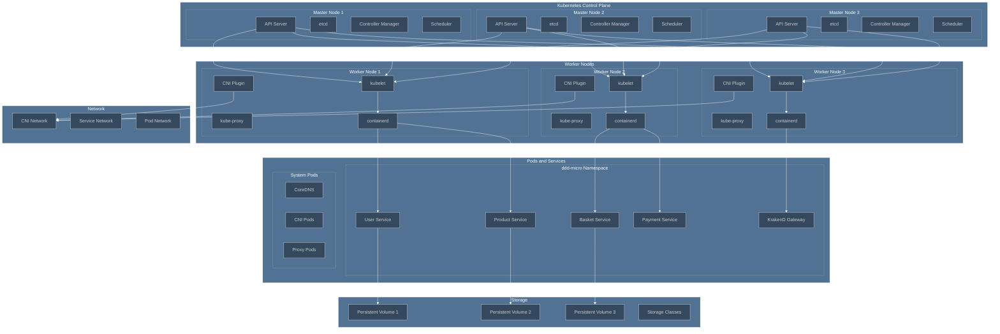

## CI/CD Pipeline Architecture

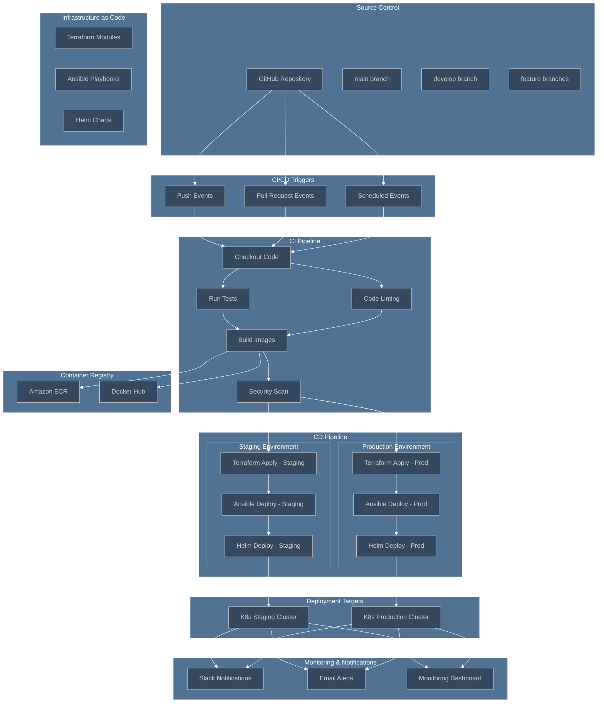

## Deployment Architecture

```mermaid
%%{init: {'theme':'dark', 'themeVariables': { 'primaryColor': '#ff6b6b', 'primaryTextColor': '#ffffff', 'primaryBorderColor': '#ff6b6b', 'lineColor': '#ffffff', 'secondaryColor': '#4ecdc4', 'tertiaryColor': '#45b7d1', 'background': '#2c3e50', 'mainBkg': '#34495e', 'secondBkg': '#2c3e50', 'tertiaryBkg': '#34495e'}}}%%
graph TB
    subgraph "Docker Containers"
        USER_CONTAINER[User Service Container]
        PRODUCT_CONTAINER[Product Service Container]
        BASKET_CONTAINER[Basket Service Container]
        PAYMENT_CONTAINER[Payment Service Container]
        GATEWAY_CONTAINER[KrakenD Gateway Container]
        KAFKA_CONTAINER[Kafka Container]
        ZOOKEEPER_CONTAINER[Zookeeper Container]
        REDIS_CONTAINER[Redis Container]
        POSTGRES_CONTAINER[PostgreSQL Container]
    end
    
    subgraph "Docker Network"
        NETWORK[ddd-micro-network]
    end
    
    USER_CONTAINER --> NETWORK
    PRODUCT_CONTAINER --> NETWORK
    BASKET_CONTAINER --> NETWORK
    PAYMENT_CONTAINER --> NETWORK
    GATEWAY_CONTAINER --> NETWORK
    KAFKA_CONTAINER --> NETWORK
    ZOOKEEPER_CONTAINER --> NETWORK
    REDIS_CONTAINER --> NETWORK
    POSTGRES_CONTAINER --> NETWORK
```